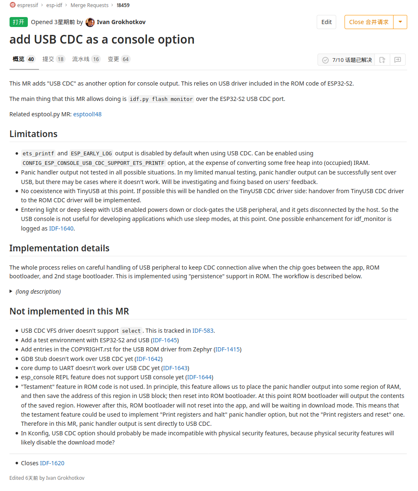

<!-- _footer: "**💕 𝙸𝙳𝙵 𝙲𝙾𝚁𝙴 𝚃𝙴𝙰𝙼 💕**" -->


# <!--fit--> Git & Workflow

## <!--fit--> Introduction of the Git Workflow in Espressif

---
<!-- _class: invert -->


# **Overview** 📖

- Get started with Git
- Professional in Git
- Submit Merge Request

---
<!-- _backgroundImage: "linear-gradient(to bottom, #8e0038, #fd558f)" -->
<!-- _color: white -->
# <!--fit--> Get Started with Git 🐾

---
<!-- paginate: true -->
<!-- _header: "**Git**" -->
<!-- _backgroundImage: url('./assets/hero-background.jpg') -->


> [Git](https://git-scm.com/) is a free and open source **distributed** version control system with *speed* and *efficiency*

---
<!-- _header: "**Remote Repository 🖥️**" -->
<!-- _backgroundImage: url('./assets/hero-background.jpg') -->
<style scoped>li { font-size: 80%;}</style>


# [GitHub](https://github.com/espressif/esp-idf) 🆚 [GitLab](https://gitlab.espressif.cn:6688/espressif/esp-idf)

- Web-based Git repository
- GitLab: **Internal** develop, **[CI/CD](https://gitlab.espressif.cn:6688/help/ci/examples/README.md)**
- GitHub: **Community** feedback, **[Action](https://help.github.com/en/actions)**
- Issue tracking
- Code review

---
<!-- _header: "**Installation 🚀**" -->
<!-- _backgroundImage: url('./assets/hero-background.jpg') -->


```bash
# Debian-based distribution
sudo apt install git

# Fedora
sudo yum install git

# Arch
sudo pacman -S git
```

```bash
# MacPorts
sudo port install git

# Homebrew
brew install git
```

[Download installer for Windows](https://gitforwindows.org/)

---
<!-- _header: "**Set up SSH for Git 🔐**" -->
<!-- _backgroundImage: url('./assets/hero-background.jpg') -->

- `ls -la ~/.ssh` to see if you already have a public SSH key (e.g. *id_rsa.pub*)
- If not, create a new public and private key pair with command **ssh-keygen**
- Add your private key to *ssh-agent* with command **ssh-add ~/.ssh/id_rsa**
- Copy the contents of **id_rsa.pub** file to GitHub/GitLab/Bitbucket...

---
<!-- _header: "**Git Manual 👨‍🏫**" -->
<!-- _backgroundImage: url('./assets/hero-background.jpg') -->
<style scoped>code { font-size: 90%; }</style>


```bash
# get common usage on 'git diff'
tldr git-diff
```

```bash
# get all available information on 'git status'
git status --help # same as 'man git-status'
# get a quick help on 'git checkout'
git checkout -h
```

---
<!-- _header: "**Create a repository ☕**" -->
<!-- _backgroundImage: url('./assets/hero-background.jpg') -->

- Navigate to the directory you want to place under version control
- Create an empty Git repository: `git init`, this creates a hidden folder **.git**, which contains the entire history and configuration for the project

```bash
mkdir oh_my_project && cd oh_my_project
git init
```

---
<!-- _header: "**Setting username and email 📭**" -->
<!-- _backgroundImage: url('./assets/hero-background.jpg') -->

```bash
cd /path/to/my/repo
git config user.name "Your name"
git config user.email "xxx@espressif.com"
```

- It will store the setting inside the individual repository: `/path/to/your/repo/.git/config`

- Advanced practice 💯: Force Git to look for your identity only within a repository's settings

  ```bash
  git config --global user.useConfigOnly true
  ```

---
<!-- _header: "**Add 🥪**" -->
<!-- _backgroundImage: url('./assets/hero-background.jpg') -->
<style scoped>li { font-size: 90%; }</style>
<style scoped>code { font-size: 90%; }</style>

- Check what files Git will add to your repository with command `git status`
- Review the resulting list of files, tell Git which of the files to place into version control (avoid adding files with confidential information)

  ```bash
  git status
  git add <file/directory name #1> <file/directory name #2> <...>
  ```

- If all files in the list should be added to version control

  ```bash
  git add -A
  ```

---
<!-- _header: "**Commit 🥪**" -->
<!-- _backgroundImage: url('./assets/hero-background.jpg') -->

- Commit all files that have been added, along with a commit message

  ```bash
  git commit -m "add README.md"
  # if you omit the -m parameter,
  # your default editor will open,
  # and you can edit and save the commit message there
  ```

- A commit is like a save or **snapshot** of your entire project
- You can now push it to a remote repository, and later you can jump back to it if necessary

---

<!-- _header: "**Create a repository on remote 🖥️**" -->
<!-- _backgroundImage: url('./assets/hero-background.jpg') -->


---
<!-- _header: "**Adding a remote 🚚**" -->
<!-- _backgroundImage: url('./assets/hero-background.jpg') -->
<style scoped>code { font-size: 80%; }</style>
<style scoped>li { font-size: 90%; }</style>

- To add a new remote, use the `git remote add` command in your local repository
- The `git remote add` command takes two arguments:
  - A remote name, e.g. **origin**
  - A remote URL
  ```bash
  git remote add origin ssh://git@gitlab.espressif.cn:27227/srmao/oh-my-project.git
  ```
- If you want to change the URL of a remote
  ```bash
  git remote set-url origin ssh://git@bitbucket.server.com:7999/username/project.git
  ```
- Show a list of existing remotes: `git remote -v`

---
<!-- _header: "**Push to remote 🚚**" -->
<!-- _backgroundImage: url('./assets/hero-background.jpg') -->

- Copy your local repository to the remote
- Adding `--set-upstream` (or `-u`) created an upstream reference which is used by argument-less Git commands (e.g. `git pull`)

  ```bash
  git push --set-upstream origin master
  ```

---
<!-- _paginate: false -->
<!-- _backgroundImage: "linear-gradient(to bottom, #0d47a1, #42a5f5)" -->
<!-- _color: white -->
# <!--fit--> Professional in Git 🐾

---
<!-- _header: "**Browsing the history 1 📜**" -->
<!-- _backgroundImage: url('./assets/hero-background.jpg') -->
<style scoped>li { font-size: 80%; }</style>
<style scoped>code { font-size: 70%; }</style>

- List last 10 commits logs, on a single line: `git log --oneline -10`
- Log for a range of lines within a file: `git log -L 1,5:README.md`
- To see the log in a prettier graph-like structure
  ```bash
  git log --decorate --oneline --graph -20
  ```
- Colorize logs
  ```bash
  git log --pretty=format:'%C(red)%h%Creset -%C(yellow)%d%Creset %s %C(green)(%cr)%C(yellow)<%an>%Creset'
  ```
  - `%C(color_name)` option colors the output that comes after it
  - `%h` abbreviates commit hash
  - `%Creset` resets color to default terminal color
  - `%d` ref names
  - `%s` subject [commit message]
  - `%cr` committer date, relative to current date
  - `%an` author name

---
<!-- _header: "**Browsing the history 2 📜**" -->
<!-- _backgroundImage: url('./assets/hero-background.jpg') -->
<style scoped>li { font-size: 80%; }</style>
<style scoped>code { font-size: 80%; }</style>

- Search for **changes** in **lines containing** specific string
  ```bash
  git log -G "#define MODEM_COMMAND_TIMEOUT_MODE_CHANGE"
  ```
- Search **commit string** in git log
  ```bash
  git log --all --grep "esp_modem"
  ```
- Filter logs
  ```bash
  git log --since '3 days ago'
  git log --author=morris
  ```
- Show the commits that are on `foo` branch but not on `master` with command:
  ```bash
  git log master..foo
  ```

---
<!-- _header: "**Aliases 🔨**" -->
<!-- _backgroundImage: url('./assets/hero-background.jpg') -->
<style scoped>code { font-size: 90%; }</style>

- Avoid typing pretty big commands by creating aliases:
  - with the command line
  ```bash
  git config --global alias.ci "commit"
  git config --global alias.st "status"
  ```
  - with the `~/.gitconfig` file
  ```bash
  [alias]
      ci = commit
      st = status
      gl  = log -n 20 --date-order --format=\"%Cgreen%h %Cred[%ci] %Creset
      <%an>%C(yellow)%d%Creset %Creset %Cgreen%s %Creset \"
  ```

---
<!-- _header: "**Staging 1 🎍**" -->
<!-- _backgroundImage: url('./assets/hero-background.jpg') -->

- If you have changed a lot of files in the directory, rather than listing each one of them, you could use:
  - `git add --all` to add all changes
  - `git add .` to add all changes, *not including files that have been deleted*, from the top-level directory and subdirectory
  - `git add -u` only add files which are currently tracked ("updated")

---
<!-- _header: "**Staging 2 🎍**" -->
<!-- _backgroundImage: url('./assets/hero-background.jpg') -->
<style scoped>li { font-size: 90%; }</style>

- Unstage a file that contains changes
  ```bash
  git restore --stage <file>
  ```
- Show staged changes
  ```bash
  git diff --cached
  ```
- Stage deleted files
  ```bash
  git rm filename
  ```
- To delete the file from git without removing it from disk
  ```bash
  git rm --cached filename
  ```

---
<!-- _header: "**Ignore 1 🤷🏻**" -->
<!-- _footer: "**[Sample files](https://github.com/github/gitignore) 💗 [Online Tool](https://www.toptal.com/developers/gitignore)**" -->
<!-- _backgroundImage: url('./assets/hero-background.jpg') -->
<style scoped>code { font-size: 90%; }</style>
<style scoped>li { font-size: 90%; }</style>

- For files that you want never under version control, create a file named `.gitignore` **before** staging
  - Can created in top level directory or sub-directories
  - Rules will apply recursively to all files and sub-directories

  ```
  # ignore files called '.config'
  .config
  # ingore directories
  bin/
  # ignore files by extension
  *.o
  # matches all files 'foo.txt' in 'bar' and all sub-directories
  bar/**/foo.txt
  # ignore all .a files but lib.a
  *.a
  !lib.a
  ```

---
<!-- _header: "**Ignore 2 🤷🏻**" -->
<!-- _backgroundImage: url('./assets/hero-background.jpg') -->
<style scoped>code { font-size: 90%; }</style>
<style scoped>li { font-size: 90%; }</style>

- Create an empty folder
  - Create the required directory and add a `.gitkeep` file to the folder
- Clean up ignored files
  ```bash
  git clean -Xn # display a list of ignored files
  git clean -Xf # remove the previously displayed files
  ```
- Find files ignored by `.gitignore`
  ```bash
  git status --ignored
  ```
- Ignore subsequent changes to a file without removing it
  ```bash
  git update-index --assum-unchanged my-file.txt
  ```

---
<!-- _header: "**Committing 1 🙋‍♂️**" -->
<!-- _backgroundImage: url('./assets/hero-background.jpg') -->
<style scoped>li { font-size: 90%; }</style>

- If you didn't create any new files, you can combine `git add` and `git commit` into a single command:
  ```bash
  git commit -am "Commit message here"
  ```
- If your latest commit is not published yet, then you can put the current staged changes onto the previous commit.
  ```bash
  git commit --amend
  ```
  - *This can also be used to edit an incorrect commit message*
  - If the earlier commit had already been pushed, after amending it you will have to push with `--force` option.

---
<!-- _header: "**Committing 2 🙋‍♂️**" -->
<!-- _backgroundImage: url('./assets/hero-background.jpg') -->
<style scoped>li { font-size: 95%; }</style>

- If you make a commit as the wrong author, you can change it and then amend
  ```bash
  git config user.name "new name"
  git config user.email "email@example.com"
  git commit --amend --reset-author
  ```
- Commit on behalf on someone else
  ```bash
  git commit -m "message" --author "John Smith <johnsmith@example.com>"
  ```
- Commit at a specific date
  ```bash
  git commit -m "Fix memory leak" --date 2018-07-03
  ```

---
<!-- _header: "**Good Commit Message 💯**" -->
<!-- _backgroundImage: url('./assets/hero-background.jpg') -->
<style scoped>code { font-size: 80%; }</style>
<style scoped>li { font-size: 80%; }</style>

```bash
vfs/fatfs: fix stat call failing when called for mount point

FATFS does not support f_stat call for drive root. When handling stat
for drive root, don't call f_stat and just return struct st with S_IFDIR
flag set.

Closes https://github.com/espressif/esp-idf/issues/984
```

- Separate the subject line from body with a blank line
- Limit the subject line to 50 characters
- Do not end the subject line with a period
- Manually wrap each line of the body at 72 characters
- Use the body to explain **what** and **why** instead of **how**

---
<!-- _header: "**Diff 1 📽️**" -->
<!-- _backgroundImage: url('./assets/hero-background.jpg') -->
<style scoped>li { font-size: 90%; }</style>

- Show *unstaged* changes on current branch from the commit before it
  ```bash
  git diff
  ```
- Show differences for stages files
  ```bash
  git diff --staged
  ```
- Show both staged and unstaged changes
  ```bash
  git diff HEAD
  ```
- Show changes between two commits
  ```bash
  git diff 1234abc..6789def # old..new
  ```

---
<!-- _header: "**Diff 2 📽️**" -->
<!-- _backgroundImage: url('./assets/hero-background.jpg') -->
<style scoped>li { font-size: 90%; }</style>

- Show the difference of a file between separate commits
  ```bash
  git diff 1234abc 6789def myfile.txt
  ```
- Produce a patch-compatible diff
  ```bash
  git diff --no-prefix > some_file.patch
  ```
  Then somewhere else you can reverse it:
  ```bash
  patch -p0 < some_file.patch
  ```

---
<!-- _header: "**Reset 🚨**" -->
<!-- _class: invert -->


---
<!-- _header: "**Recovering 🏥**" -->
<!-- _class: invert -->


---
<!-- _header: "**Undoing 🔙**" -->
<!-- _backgroundImage: url('./assets/hero-background.jpg') -->
<style scoped>li { font-size: 90%; }</style>

- Undo changes to a file or directory in the **working copy**
  ```bash
  git checkout -- file.txt
  ```
- To **temporarily** jump back to a commit, detach your head
  ```bash
  git checkout 789abcd
  ```
  This places you at commit 789abcd, you can now make new commits on top this old commit without affecting the branch your head is on.

---
<!-- _header: "**Branching 1 🌳**" -->
<!-- _backgroundImage: url('./assets/hero-background.jpg') -->
<style scoped>li { font-size: 90%; }</style>

- Create a new branch, while staying on the current branch
  ```bash
  git branch <name> [<start-point>]
  ```
- Switch to an existing branch
  ```bash
  git checkout <name>
  ```
- Create a new branch and switch to it
  ```bash
  git checkout -b <name> [<start-point>]
  ```
- **<start-point>** can be any revision known to git (e.g. branch name, commit SHA, symbolic reference such as HEAD or a tag name)

---
<!-- _header: "**Branching 2 🌳**" -->
<!-- _backgroundImage: url('./assets/hero-background.jpg') -->
<style scoped>li { font-size: 80%; }</style>

- Create a branch from a remote branch
  ```bash
  git checkout -b <name> <remote_name>/<branch_name>
  ```
- Listing branches
  ```bash
  git branch # List local branches
  git branch -r # List remote branches
  git branch -a # List remote and local branches
  ```
- Delete a remote branch
  ```bash
  git push origin --delete <branchName>
  ```
- Delete a local branch
  ```bash
  git branch -d <branchName> # Won't delete the branch if it has unmerged changes
  git branch -D <branchName> # Delete it event if it has unmerged changes
  ```

---
<!-- _header: "**Branching 3 🌳**" -->
<!-- _backgroundImage: url('./assets/hero-background.jpg') -->
<style scoped>li { font-size: 80%; }</style>

- Quick switch to the previous branch
  ```bash
  git checkout -
  ```
- Rename a branch
  - rename the branch you have already checked out
  ```bash
  git branch -m new_branch_name
  ```
  - rename another branch
  ```bash
  git branch -m branch_you_want_rename new_branch_name
  ```
- List local and remote branches that contain a specific commit
  ```bash
  git branch -a --contains <commit>
  ```

---
<!-- _header: "**Branching Model 🧾**" -->
<!-- _backgroundImage: url('./assets/hero-background.jpg') -->
<style scoped>li { font-size: 88%;}</style>

- **master branch** 👍
  - Name: `master`
  - Where *integration* happens
  - Produce working code which compiles and passes CI tests
- **feature and bugfix branches** 🐞
  - Name: `feature/xxx` and `bugfix/xxx`
  - Where *development* happens
  - May contain broken or incomplete or testing code
- **release branches** 💪🏽
  - Name: `release/v4.0`
  - Where releases are maintained and bugfixes are backported to

---
<!-- _header: "**Clone a repository☕**" -->
<!-- _backgroundImage: url('./assets/hero-background.jpg') -->
<style scoped>li { font-size: 80%;}</style>

- The `git clone` command is used to copy an existing Git repository from a server to your local machine
  ```bash
  cd <path where you would like to clone to create a directory>
  git clone https://github.com/username/projectname.git
  # ssh version of the command
  git clone git@github.com:username/projectname.git
  ```
- If you don't need to have the full history available, you can do a shallow clone
  ```bash
  git clone [repo_url] --depth 1
  ```
  - later, if required, you can fetch the rest of the repository
  ```bash
  git fetch --unshallow
  ```

---
<!-- _header: "**Working with Remotes 1 🏓**" -->
<!-- _backgroundImage: url('./assets/hero-background.jpg') -->
<style scoped>li { font-size: 90%; }</style>

- List existing remotes
  ```bash
  git remote -v
  ```
- Change Git remote URL
  ```bash
  git remote set-url remote-name https://github.com/username/repo2.git
  ```
- Add a new remote repository
  ```bash
  git remote add github git-repository-url
  ```
- Push to a remote branch
  ```bash
  git push <remote_name> <branch_name>
  ```

---
<!-- _header: "**Working with Remotes 2 🏓**" -->
<!-- _backgroundImage: url('./assets/hero-background.jpg') -->
<style scoped>li { font-size: 90%; }</style>

- Delete a remote branch
  ```bash
  git push [remote-name] --delete [branch-name]
  ```
- Remove local copies of deleted remote branches
  ```bash
  git fetch [remote-name] --prune
  ```
- Updating from upstream repository
  ```bash
  git fetch remote-name
  git merge remote-name/branch-name
  ```
  - `git pull` combines a `fetch` and a `merge`
  - `git pull --rebase remote-name branch-name` combines a `fetch` and a `rebase`

---
<!-- _header: "**Fetch 🆚 Pull**" -->
<!-- _class: invert -->


---
<!-- _header: "**Merging (ff) 👪**" -->
<!-- _class: invert -->


- No new commit created

---
<!-- _header: "**Merging (no-ff) 👪**" -->
<!-- _class: invert -->


- New commit created

---
<!-- _header: "**Reverting ❎**" -->
<!-- _class: invert -->
<style scoped>li { font-size: 80%;}</style>


- Undo a certain commit without modifying history

---
<!-- _header: "**Solve Conflict 💣**" -->
<!-- _class: invert -->


---
<!-- _header: "**Rebasing 🕹️**" -->
<!-- _class: invert -->
<style scoped>li { font-size: 80%;}</style>


- It changes the history of the project

---
<!-- _header: "**Interactive Rebasing 🕹️**" -->
<!-- _backgroundImage: url('./assets/hero-background.jpg') -->
<style scoped>li { font-size: 80%; }</style>

- Using interactive rebase, the user can **reword**, **reorder**, **drop**, **split**, **squash** commits
- Rearrange your last three commits
  ```bash
  git rebase -i HEAD~3
  ```
  - A file will be opened in your text editor where you will be able to select how your commits will be rebased.
  - After you changed the file, save it and close the editor.
  - This will initiate a rebase with the changes you've applied.
- Aborting an interactive rebase
  ```bash
  git rebase --abort
  ```
- **git push** complains because your rebase has rewrote the history
  ```bash
  git push --force-with-lease # this can be solved appending a "force" option
  ```

---
<!-- _header: "**Reorder Commits 🔁**" -->
<!-- _class: invert -->
<style scoped>li { font-size: 80%;}</style>


- Reorder the commits in the opened text editor

---
<!-- _header: "**Drop Commits 💧**" -->
<!-- _class: invert -->


---
<!-- _header: "**Reword Commits 💬**" -->
<!-- _class: invert -->
<style scoped>li { font-size: 80%;}</style>


- Replace *pick* with *reword* instead

---
<!-- _header: "**Squash Commits 📥**" -->
<!-- _class: invert -->


---
<!-- _header: "**Split Commit 🪓**" -->
<!-- _class: invert -->
<style scoped>li { font-size: 80%;}</style>


- Replace *pick* with *edit* instead

---
<!-- _header: "**Cherry Picking 🍒**" -->
<!-- _class: invert -->
<style scoped>li { font-size: 80%;}</style>


- The new commit *9e78i* has the same content as *76d12* but a different parent

---
<!-- _header: "**Stashing 1 🧱**" -->
<!-- _backgroundImage: url('./assets/hero-background.jpg') -->
<style scoped>blockquote { font-size: 80%;}</style>


> When working on a project, you might be **half-way** through a feature branch change when a bug is raised against master. You're **not ready to commit** your code, but you also don't want to lose your changes. This is where **git stash** comes in handy.

---
<!-- _header: "**Stashing 2 🧱**" -->
<!-- _backgroundImage: url('./assets/hero-background.jpg') -->
<style scoped>li { font-size: 60%; }</style>

- Save the current state of working directory in a stack of stashes
  ```bash
  git stash
  git stash --include-untracked # include all untracked files
  git stash save "<whatever message>" # include a message with stash
  ```
- List saved stashed
  ```bash
  git stash list
  ```
- Apply the last stash and remove it from the stack
  ```bash
  git stash pop
  git stash pop stash@{n} # apply specific stash and remove it from stack
  ```
- Apply the last stash without removing it from the stack
  ```bash
  git stash apply
  ```
- Remove stash
  ```bash
  git stash clear # remove all stash
  git stash drop # remove the last stash
  ```

---
<!-- _header: "**Worktree 🌳**" -->
<!-- _backgroundImage: url('./assets/hero-background.jpg') -->
<style scoped>li { font-size: 80%; }</style>

- Create a new directory with the specified branch checked out into it
  ```bash
  git worktree add path/to/directory -b new_branch
  ```
- List all the working directories attached to this repository
  ```bash
  git worktree list
  ```
- Remove a worktree (after deleting worktree directory)
  ```bash
  git worktree prune
  ```

---
<!-- _header: "**Tagging 🔖**" -->
<!-- _backgroundImage: url('./assets/hero-background.jpg') -->
<style scoped>li { font-size: 70%; }</style>

> To tag specific points in history (e.g. release point) as being important.

- List all available tags
  ```bash
  git tag
  ```
- Create a tag on your current branch
  ```bash
  git tag <tag_name>
  ```
- Create a tag with some commit
  ```bash
  git tag tag-name commit-id
  ```
- Push a commit to remote
  ```bash
  git push origin tag-name
  ```

---
<!-- _header: "**Submodules 1 🍪**" -->
<!-- _backgroundImage: url('./assets/hero-background.jpg') -->
<style scoped>li { font-size: 85%; }</style>

- Cloning a Git repository having submodules
  ```bash
  git clone --recursive https://github.com/username/repo.git
  ```
  - This is equivalent to running the following command after the clone is finished
    ```bash
    git submodules update --init --recursive
    ```
- Include another Git repository as a folder within your project, tracked by Git:
  ```bash
  git submodule add https://github.com/ARMmbed/littlefs.git
  ```
  - you should add and commit `.gitmodules` file, telling Git what submodules should be cloned when `git submodule update` is run

---
<!-- _header: "**Submodules 2 🍪**" -->
<!-- _backgroundImage: url('./assets/hero-background.jpg') -->

- Moving a submodule
  ```bash
  git mv /path/to/module new/path/to/module
  ```
- Removing a submodule (e.g. the_submodule)
  ```bash
  git submodule deinit the_submodule
  git rm the_submodule
  ```

---
<!-- _header: "**Finding faulty commits ⭕**" -->
<!-- _backgroundImage: url('./assets/hero-background.jpg') -->
<style scoped>li { font-size: 80%; }</style>

- To find which commit introduced a bug using a binary search.
  ```bash
  # start the git bisect
  git bisect start
  # give a commit where the bug doesn't exist
  git bisect good 49c747d
  # give a commit where the bug exist
  git bisect bad HEAD
  ```
- Git splits the revision in half and switches the repository to the intermediate revision.
  - Inspect the code to determine if the revision is good or bad:
  ```bash
  # tell git the revision is good
  git bisect good
  # if the revision contains the bug, then tell git it's bad
  git bisect bad
  ```
- To abort the bisect process, just issue `git bisect reset`

---
<!-- _header: "**Blaming 🤔**" -->
<!-- _backgroundImage: url('./assets/hero-background.jpg') -->
<style scoped>li { font-size: 90%; }</style>

- Find out who changed a file
  - show the author and commit per line of the specified file
  ```bash
  git blame test.c
  ```
  - ignore whitespace-only changes
  ```bash
  git blame -w test.c
  ```
  - limits the selection of lines by specified range
  ```bash
  git blame -L 1,10 test.c
  ```
  - +offset, -offset
  ```bash
  git blame -L 108,+30 test.c
  ```

---
<!-- _header: "**Patch 👖**" -->
<!-- _backgroundImage: url('./assets/hero-background.jpg') -->
<style scoped>li { font-size: 80%; }</style>

- Create a patch
  - Make your changes and commit them
  - Convert commits into patch files
  ```bash
  # convert all commits since <commit-reference> (not including it)
  git format-patch <commit-reference>
  ```
- Apply patches
  - Have the changes from the `.patch` file applied to your current working directory (unstaged)
  ```bash
  git apply some.patch
  ```
  - Apply a patch as a commit
  ```bash
  git am some.patch
  git am *.patch # apply all patch files
  ```

---
<!-- _header: "**Clean 🧹**" -->
<!-- _backgroundImage: url('./assets/hero-background.jpg') -->

- Clean interactively
  ```bash
  git clean -i
  ```
- Forcefully remove untracked files
  ```bash
  git clean -f
  ```
- Clean ignored files
  ```bash
  git clean -fx
  ```

---
<!-- _header: "**Git GUI**" -->
<!-- _footer: "**[SmartGit](https://www.syntevo.com/smartgit/) 💗 [Sourcetree](https://www.sourcetreeapp.com/) 💗 [Lazygit](https://github.com/jesseduffield/lazygit)**" -->
<!-- _backgroundImage: url('./assets/hero-background.jpg') -->


---
<!-- _paginate: false -->
<!-- _backgroundImage: "linear-gradient(to bottom, #FF6D00, #FFAB40)" -->
<!-- _color: white -->

# <!--fit--> Submit a Merge Request on GitLab 🙌🏻

---
<!-- _header: "**General Workflow on GitLab 🖥️**" -->
<!-- _backgroundImage: url('./assets/hero-background.jpg') -->


---
<!-- _header: "**Submit MR ⛷️**" -->
<!-- _backgroundImage: url('./assets/hero-background.jpg') -->


---
<!-- _header: "**Good MR Description 💯**" -->
<!-- _backgroundImage: url('./assets/hero-background.jpg') -->



---
<!-- _header: "**Merge Request Comments 💬**" -->
<!-- _backgroundImage: url('./assets/hero-background.jpg') -->
<style scoped>li { font-size: 70%; }</style>


- Ask @bot to do tests
  - build test
  - unit test
  - integration test
  - language lint
  - ...
- Ask colleagues to review your code
- After you got more than **Two** 👍 and your MR passed CI pipeline, reassign your MR to someone who has the permission to merge

---
<!-- _header: "**Community Etiquette 💁🏻‍♂️**" -->
<!-- _backgroundImage: url('./assets/hero-background.jpg') -->
<style scoped>li { font-size: 80%; }</style>


- Be **polite**, even if the code doesn't look good to you
- Try best to **review** PR/MR within 1 week after someone asked you to
- If the MR looks good to you, don't forget to give a **thumbup** 👍

---
<!-- _header: "**Book Recommendation 📚**" -->
<!-- _backgroundImage: url('./assets/hero-background.jpg') -->


[ProGit Book](https://git-scm.com/book/en/v2)

---
<!-- _header: "**Learn Git the Easy Way 🍰**" -->
<!-- _backgroundImage: url('./assets/hero-background.jpg') -->


# <!--fit--> Learn by Gaming -- `GitHug`

[GitHug Walk Through Guide](https://githug.zhang-ou.com/)

# <!--fit--> Learn in interactive way

[Learn Git Branching](https://learngitbranching.js.org/)

---
<!-- _header: "**QA and Acknowledgements 🤗**" -->
<!-- _backgroundImage: url('./assets/hero-background.jpg') -->
<style scoped>li { font-size: 80%; }</style>


- @theavocoder, [CS Visualized: Useful Git Commands](https://dev.to/lydiahallie/cs-visualized-useful-git-commands-37p1)
- @Stack Overflow Documentation, [Git Notes for Professionals](https://goalkicker.com/GitBook/)
